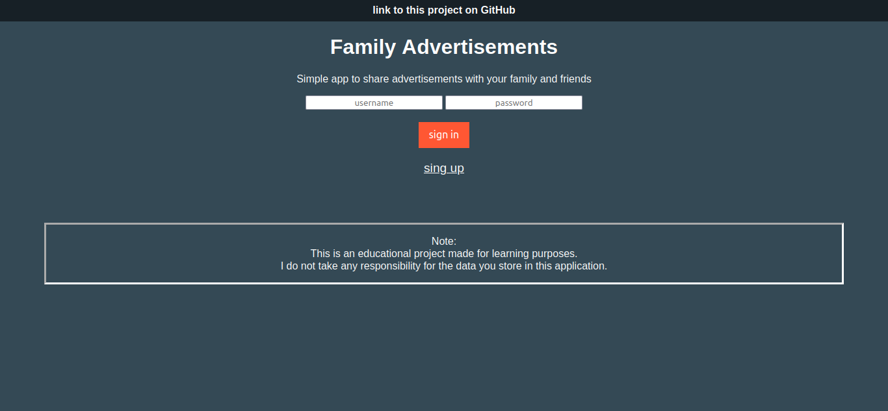
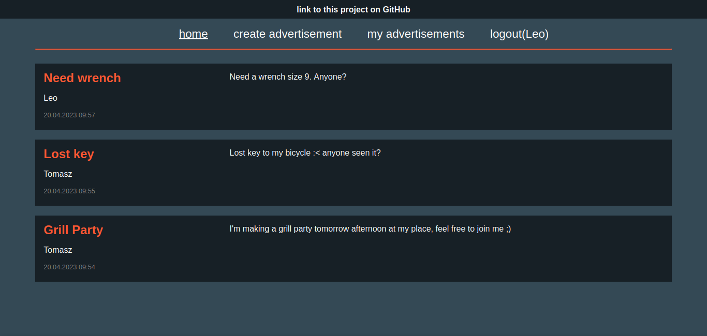

# Family Advertisements
Simple app to share advertisements with your family and friends  

> Live demo hosted on Microsoft Azure [_here_](https://family-advertisements.kindfield-de13d961.westeurope.azurecontainerapps.io/).

## Table of Contents
* [General Info](#general-information)
* [Technologies Used](#technologies-used)
* [Features](#features)
* [Screenshots](#screenshots)
* [Project Status](#project-status)
* [Room for Improvement](#room-for-improvement)

## General Information
This project was developed to practice the Spring Framework. The idea was to 
create a simple but fully functional solution which covers all aspects - starting from UI and on persistence layer ending, of a live application.   
From user perspective it's an advertising service inspired by solutions like OLX or Allegro, 
but for a small group of people, namely your family and friends. 
By definition, it provides an intimate space for your 
close ones to let them know that you throw a party or need help with your broken car.

## Technologies Used
- Java - version 17
- Spring boot starter web - version 3.0.4
- Spring boot starter security - version 3.0.4
- Spring boot starter data jpa - version 3.0.4
- Spring boot starter validation - version 3.0.4
- Spring boot starter test - version 3.0.4
- Thymeleaf - version 3.0.4
  - HTML templates
  - CSS styling
- Lombok - version 1.18.26
- Jasypt - version 2.1.2
- SpringDoc OpenAPI - version 2.1.0
- Persistence layer - Microsoft Azure SQL Database
- Apache Tomcat server hosting -  Microsoft Azure Spring Apps

I decided to use two approaches in terms of serving data to the end user:
1. To expose a graphical UI, a server-side rendering Java template, namely Thymeleaf is used.
2. As Thymeleaf does not support REST API, I implemented separately Rest Controllers. The REST API can be accessed via Swagger.

## Features
User perspective:
- Creation of a _User_ entity. Username and password must meet validation requirements.
- User authentication.
- Viewing a list of all _Advertisement_ entities.
- Creation of a new _Advertisement_ entity. Title and description must meet validation requirements.
- Viewing a list of _Advertisement_ entities created by currently logged-in user. With the ability to delete and edit them.

Implementation details:
- _User_ and _Advertisement_ entities are stored in a relational database, utilizing JPA.
- _User_ password is encoded using BCryptPasswordEncoder.
- When passing _User_ password within the Java programm, no `String` is used, only `char[]`, which is cleared afterwards for security reasons.
- User authentication utilizes Spring Security.
- Key features are tested by unit and integration tests, with help of Mockito.
- The UI is rendered by use of Thymeleaf.
- Fields of _User_ and _Advertisement_ model classes are validated using Jakarta validation constraints. The password field has a custom validator implementation.
- The database password is encrypted in `application.properties` using Jasypt.
- Custom whitelabel error page and full error handling with messages printed to the user.

## Screenshots
Login page

Home page

## Project Status
Project is: _in progress_, but a stable first version is already deployed.

## Room for Improvement
To do:
- YAML configuration file instead of application.properties.
- Add admin group (now there is only a single user group).
- Add _change password_ feature.
- Add a family/friends membership group, to limit visibility of an _Advertisement_ to a single group of people.

